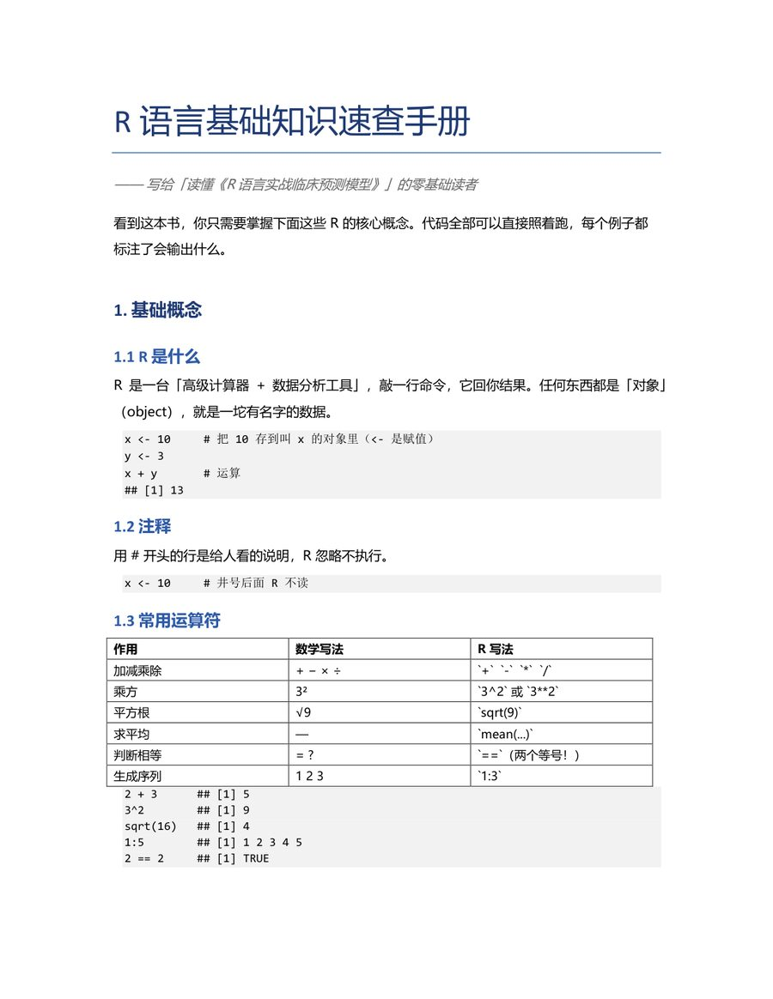

# R 语言基础知识速查手册

> **R 语言基础知识速查手册 — 写给想读懂《R 语言实战临床预测模型》零基础读者的速查文档；覆盖向量、数据框、函数、apply、公式 ~ 等核心概念与常用代码，附可直接运行的示例和预期输出。**

## 📸 效果预览（手册首页）

## 📖 内容简介

本手册把学习《R 语言实战临床预测模型》所需的 **R 语言核心基础** 整理成一份可随身查阅的文档，共 11 章：

1. 基础概念（R 是什么、赋值 `<-`、注释 `#`、常用运算符）
2. 向量（vector）与向量化
3. 逻辑（TRUE / FALSE）与筛选
4. 数据框（data.frame）—— 一张表的操作
5. 函数 与 apply
6. 公式 `~`
7. 常用包与命名空间
8. 数据的读入与导出
9. 其他常用小函数汇总
10. 新手必踩的坑
11. 数据处理项目架构模板

每章都配有**可直接运行的代码示例**和**预期输出**，方便对照学习。

## 📄 文件

- `R语言基础知识速查手册.docx` —— 主文档（可直接用 Word 打开）

## 🙏 来源与致谢

本手册为个人学习笔记，编写时参考并引用了以下来源：

- 书名：《R 语言实战临床预测模型》
- 作者：阿越就是我（GitHub：ayueme）
- 在线阅读：<https://ayueme.github.io/R_clinical_model/>
- 源码仓库：<https://github.com/ayueme/R_clinical_model>
- 主要参考章节：第 6 章《常见的数据预处理方法》
- 相关公众号：《医学和生信笔记》

上述来源内容的相关版权归原作者所有，本手册仅供个人学习使用。

## 📄 许可

MIT License —— 见 [LICENSE](LICENSE)。
